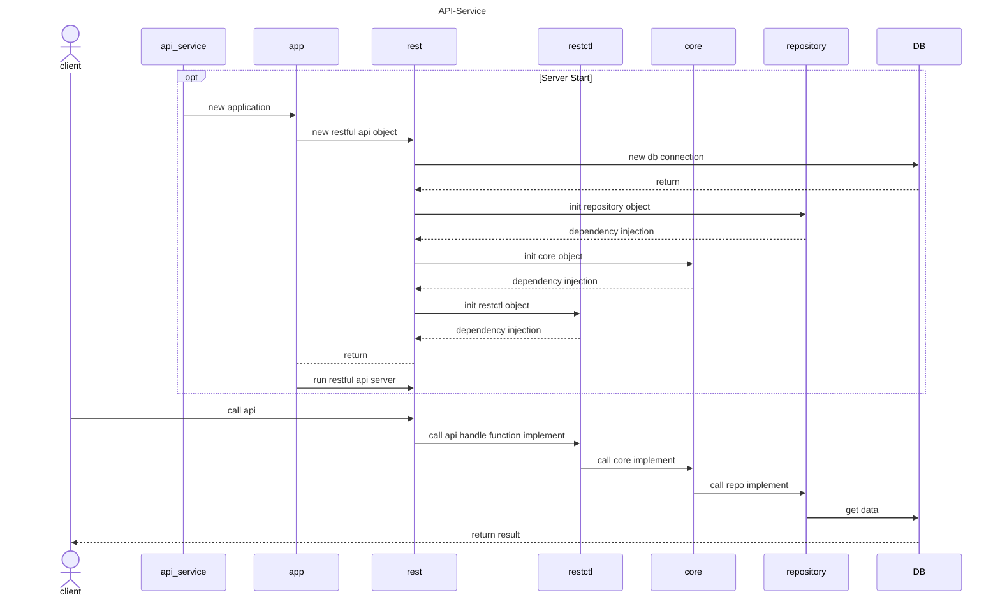
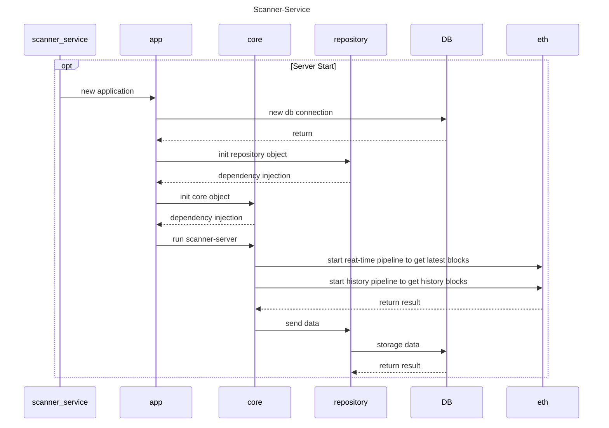

# Scanner Server
Scan blockchain data to DB and provide api to search

# Folder Structure
---
    |-- Project
        |-- cmd
            |-- {command name}          ---如果有多個service要啟動的話
                |-- main.go
        |-- conf.d 
            |-- app.yaml                ---config file
        |-- internal
            |-- constant
            |-- model                   ---define struct
            |-- db                      ---db連線
            |-- utils                   ---專案內部的通用工具
        |-- service
            |-- {service name}          ---如果有多個service要開發的話
                |-- config              ---service config define
                |-- app                 ---啟動點＋註冊
                |-- controller          ---handler function。request 和 response 的物件宣告在handler function裡面

---

# API Document
```
1. open docs/index.html
2. select local json file to open docs/swagger.json
```

# Start Service
```
go run ./cmd/api-server/main.go
go run ./cmd/scanner-server/main.go
```

or
```
docker-compose up -d
```

# Sequence Diagram




## TODO List

- [x] update docker-compose.yml
- [ ] unit test
- [ ] optimizer scanner-server eth request
